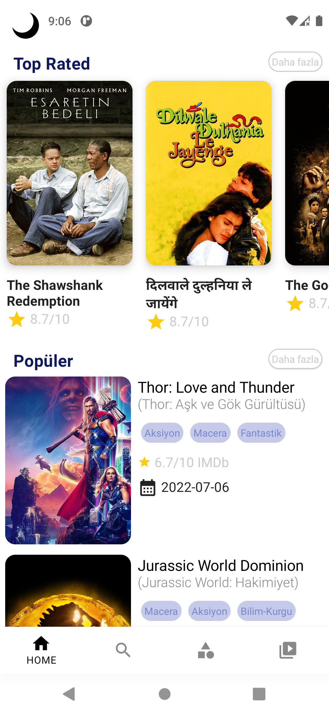

# JetMovies
I built this project with Jetpack Compose and TheMovieDb API.

### Used:
* Jetpack Compose
* Coroutines, Flow, State Flow
* ViewModel
* <a href="https://developer.android.com/jetpack/compose/layouts/constraintlayout" target = "_blank">Constraint Layout in Compose </a>
* <a href="https://developer.android.com/jetpack/compose/navigation" target = "_blank">Jetpack Navigation - Compose</a> 
* <a href="https://developer.android.com/training/dependency-injection/hilt-android" target = "_blank">Hilt for Dependency Injection</a>
* <a href="https://github.com/square/retrofit" target = "_blank">Retrofit2</a>
* <a href="https://github.com/square/okhttp/tree/master/okhttp-logging-interceptor" target = "_blank">OkHttp3 Logging interceptor</a>
* <a href="https://coil-kt.github.io/coil/compose/" target = "_blank">Coil for loading and displaying image</a>
* <a href="https://developer.android.com/training/data-storage/room" target = "_blank">Room - Data storage</a>
* <a href="https://developer.android.com/topic/libraries/architecture/paging/v3-overview" target = "_blank">Paging3</a>
* <a href="https://google.github.io/accompanist/" target = "_blank">Accompanist (Flow layouts, System UI Controller)</a>

## Home, Popular, TopRated
 </img>
 </img>
 </img>

## Genres, Watch List
  </img>
  </img>

## Search
  </img>
  </img>

## Detail

